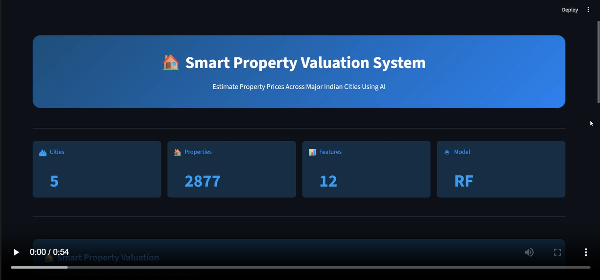
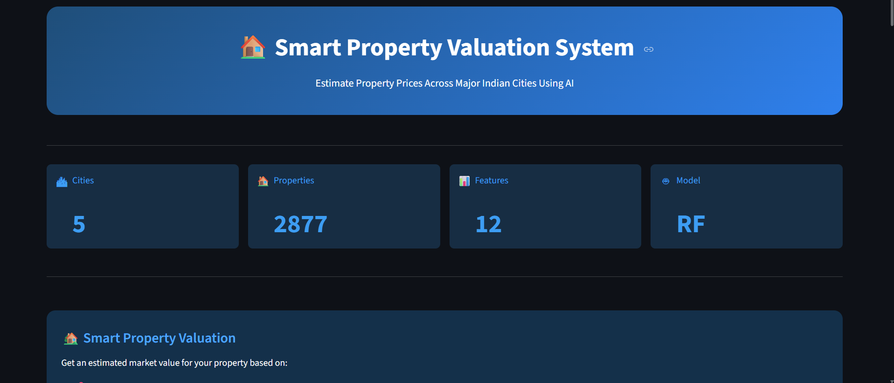
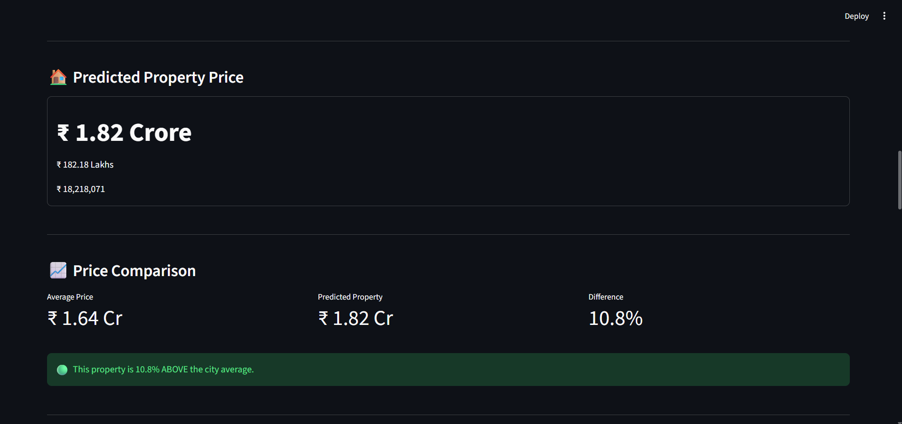

# 🏠 Smart Property Valuation System

An AI-powered Real Estate Analytics Dashboard that predicts residential property prices across major Indian cities using Machine Learning.

The application combines data preprocessing, feature engineering, machine learning, interactive visualizations, and location intelligence to provide users with accurate property price estimates and valuable market insights.

---


### Full Application Walkthrough

# 🎥 Demo

[](Screenshots/demo.mp4)

---

# 📸 Screenshots

## Dashboard Overview



## Price Prediction & Analytics



---

# ✨ Key Features

### 🏡 Smart Property Valuation

Predict property prices based on:

- Property Location
- Area Name
- BHK Configuration
- Bathroom Count
- Balcony Count
- Property Size (sqft)
- Furnishing Status
- Facing Direction
- Floor Information
- Property Status
- Transaction Type

---

### 📈 Market Comparison

Compare predicted property value against market averages.

Displays:

- Average Market Price
- Predicted Property Price
- Percentage Difference

---

### 🏆 Property Classification

Automatically categorizes properties as:

- Budget Property 💰
- Premium Property ⭐
- Luxury Property 👑

---

### 📊 Feature Importance Analysis

Visualizes the most influential features affecting price prediction using Random Forest Feature Importance.

Examples:

- Area Name
- Area Size
- BHK
- Bathrooms
- City
- Floor Information

---

### 📍 Interactive Property Location Map

Displays selected city location on an interactive map.

Supported Cities:

- Hyderabad
- Mumbai
- Delhi
- Chennai
- Pune

---

### 📋 Property Summary

Provides a quick overview of:

- City
- Area
- BHK
- Bathrooms
- Balcony
- Area Size

---

### 📊 Market Snapshot

Dataset-level insights:

- Average Property Price
- Median Property Price
- Maximum Property Price

---

# 🤖 Machine Learning Pipeline

## Data Cleaning

- Missing value handling
- Data formatting
- Feature preparation

## Feature Encoding

### One Hot Encoding

Applied to:

- Status
- Transaction
- Furnishing
- Facing
- City

### Target Encoding

Applied to:

- Area_Name

## Feature Scaling

StandardScaler applied to:

- Bathroom
- Balcony
- BHK
- Area(sqft)
- Floor_No
- Total_Floors

## Model Training

### Random Forest Regressor

Used for final property price prediction due to its ability to capture complex relationships and non-linear patterns in real estate data.

---

# 📂 Project Structure

```text
ML_House_Price_Prediction/

│
├── app.py
├── ML_cleaned_real_estate.csv
├── Real_Estate_Price_Predictor.pkl
├── requirements.txt
├── README.md
│
└── Screenshots/
    ├── Dashboard.png
    ├── prediction.png
    └── demo.mp4
```

---

# 🛠 Tech Stack

## Frontend

- Streamlit

## Data Processing

- Pandas
- NumPy

## Machine Learning

- Scikit-Learn
- Category Encoders
- Joblib

## Visualization

- Streamlit Charts
- PyDeck Maps

---

# 📈 Dataset Overview

| Metric | Value |
|----------|----------|
| Cities | 5 |
| Records | 2877 |
| Features | 12 |
| Model | Random Forest |

Supported Cities:

- Delhi
- Mumbai
- Chennai
- Hyderabad
- Pune

---

# 📈 Model Performance

Four regression algorithms were evaluated to identify the most suitable model for property price prediction.

| Model                   | R² Score   | Adjusted R² |
| ----------------------- | ---------- | ----------- |
| Random Forest Regressor | **0.5745** | **0.5536**  |
| Decision Tree Regressor | 0.5324     | 0.5094      |
| KNN Regressor           | 0.4155     | 0.3867      |
| Linear Regression       | -1.9551    | -2.1007     |

### Model Selection

Random Forest Regressor achieved the highest R² and Adjusted R² scores among all evaluated models and was therefore selected as the final deployment model.

The model captures approximately 57% of the variance in property prices, outperforming Decision Tree, KNN, and Linear Regression models on the dataset.

---

# 🚀 Installation

Clone the repository:

```bash
git clone https://github.com/yourusername/ML_House_Price_Prediction.git
```

Move into project directory:

```bash
cd ML_House_Price_Prediction
```

Install dependencies:

```bash
pip install -r requirements.txt
```

Run the application:

```bash
streamlit run app.py
```

---

# 🎯 Future Improvements

- Hyperparameter Optimization
- Advanced Price Trend Analysis
- Property Recommendation System
- Interactive City-Level Dashboards
- Enhanced Geospatial Analytics
- Model Performance Monitoring

---

# 👨‍💻 Author

### Sravan

Aspiring Data Analyst & Machine Learning Engineer

---

### ⭐ If you found this project useful, consider giving it a star.